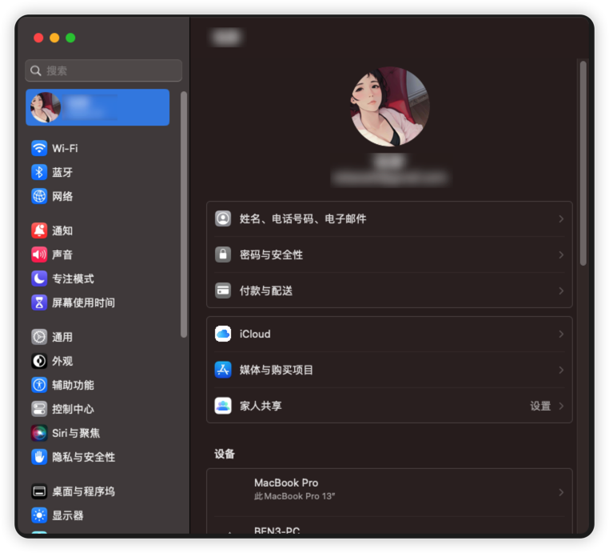

# Huawei Matebook X 2020 Hackintosh For Ventura

#### 介绍

华为matebook x 2020 的i5 10代CPU款黑苹果EFI For Ventura  
自用，仅适配此电脑配置

#### 电脑配置

HuaWei Matebook X 2020 i5 款  
CPU: i5 10210U Comet Lake  
GPU: Intel HD 630 (Intel HD Graphics CFL CRB)  
RAM: 16G (8+8)  
HHD: 512G  
Wifi & BT: Intel AX210

#### 安装教程

将 EFI 文件夹放置入引导的目录里即可

#### 使用说明

##### 正常可用

1. CPU、GPU正常
2. 硬盘正常
3. WiFi使用驱动基本正常，偶尔会有个别WiFi点加入不了，不清楚原因
4. BT驱动基本正常，某些蓝牙鼠标无法驱动……
5. 系统自带触控板正常，工作在GPIO模式
6. 系统合盖睡眠正常
7. 系统合盖切换成外部显示器输出正常
8. 系统可以正常升级更新
9. iCloud等可以正常登录
10. AppStore在插一个带网卡的扩展坞后可以正常下载

##### 存在些问题

1. 无法使用开盖唤醒，只能使用电源键（可能还有救）
2. 左边TypeC端口输出Hdmi显示会不稳定，右边正常
3. 自带2个TypeC端口正常，但是某些情况下会发生系统提示U盘供电不足的现象，未知原因
4. 蓝牙某些鼠标不能用（联想小新、联想YOGA2，应该是通用问题）

##### 无法使用

1. 自带USB摄像头（可能还有救）
2. 自带指纹

#### 截图显示

